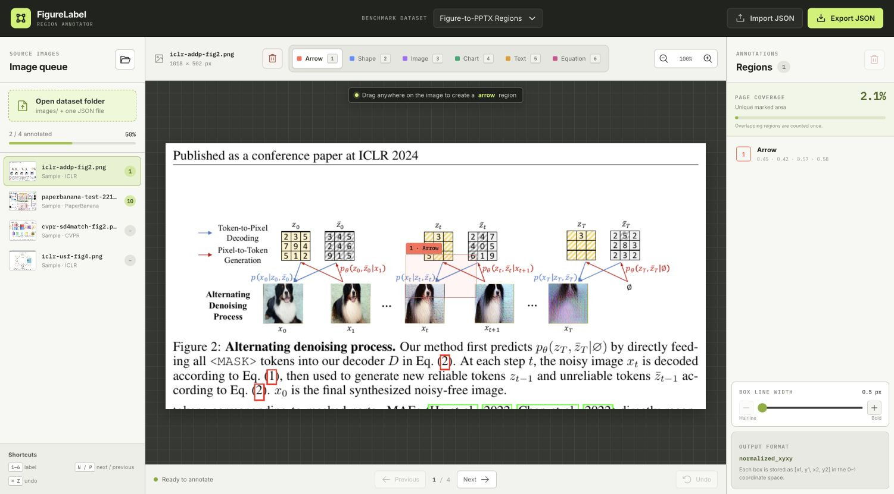
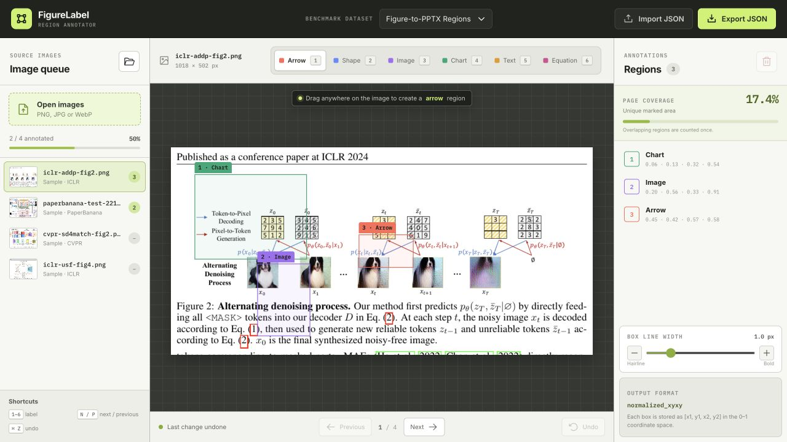

# FigureLabel 使用说明

FigureLabel 是面向 Figure-to-PPTX Benchmark 的浏览器区域标注工具。标注员先判断图片是否适合作为数据集样本，再在保留的原图上框选高风险语义区域，并赋予以下六类 label 之一：

- `arrow`
- `shape`
- `image`
- `chart`
- `text`
- `equation`

> 一张图片可以同时包含多种 label。每个区域只选一种 label，但不同区域允许部分或完全重叠。



## 1. 获取与启动

### 方式一：使用 Git

```bash
git clone https://github.com/goya4140/figure-region-annotator.git
cd figure-region-annotator
npm install
npm start
```

命令会生成生产版网页，在本机 `http://127.0.0.1:4173/` 启动服务，并自动打开默认浏览器。

### 方式二：下载 ZIP

1. 进入 GitHub 仓库页面。
2. 点击 **Code → Download ZIP**。
3. 解压后进入目录，运行 `npm install` 和 `npm start`。

### 方式三：双击启动（推荐给标注员）

- macOS：双击 `START_HERE.command`；
- Windows：双击 `START_HERE.bat`。

首次启动时，脚本会自动安装依赖，然后打开本地标注页面。标注期间请保持启动窗口运行；关闭窗口或按 `Ctrl+C` 即可停止本地服务。

> 工具只监听本机 `127.0.0.1`。图片和标注数据在本地浏览器中处理，不会上传到远程服务器。

环境要求：

- Node.js 18 或更高版本；
- 推荐使用最新版 Chrome、Edge 或其他 Chromium 浏览器；
- 若需直接删除本地图片并改写 JSON，浏览器需支持可写目录访问。

## 2. 准备数据集文件夹

工具的主要导入单元是一个完整数据集文件夹：

```text
my-dataset/
├── images/
│   ├── figure-001.png
│   ├── figure-002.jpg
│   └── figure-003.webp
└── annotations.json
```

要求：

- 根目录必须有且只有一个 `.json` 文件；
- 图片位于 `images/` 目录；
- 支持 PNG、JPG/JPEG 和 WebP；
- JSON 中的 `file_name` 用于匹配图片文件名。

## 3. 导入数据集

1. 点击左侧 **Open dataset folder**。
2. 选择包含 `images/` 和 JSON 的数据集根目录。
3. 浏览器请求目录权限时，根据标注任务授予访问权限。
4. 导入成功后，左侧 **Image queue** 会显示全部图片和已有标注数量。

如果文件夹结构错误、JSON 无法解析或 `images/` 中没有受支持图片，底部状态栏会显示原因。

## 4. 画框与选择 Label

### 新建区域

1. 在顶部选择 `Arrow`、`Shape`、`Image`、`Chart`、`Text` 或 `Equation`。
2. 在图片上按住鼠标左键并拖动。
3. 松开鼠标后即创建区域。

也可以使用数字键 `1–6` 快速切换 label。

### 编辑区域

- **移动**：拖动已有框体。
- **缩放**：选中区域后，拖动四角控制点。
- **改 label**：选中区域后，点击顶部 label，或在右侧 **Selected Region** 中选择。
- **删除区域**：选中区域后按 `Delete`/`Backspace`，或点击右侧垃圾桶按钮。
- **撤销**：按 `Cmd/Ctrl + Z`，或点击底部 **Undo**。

### 重叠区域

区域不是互斥分割，因此可以直接在已有区域上再画新框。例如：

- 一个完整局部图表可标为 `chart`；
- 图表上方独立的关键标题可另建 `text` 区域；
- 两个 bbox 可以相交或完全重合。

不要为了让框互不相交而故意缩小或切碎标注。



## 5. 六类 Label 速查

| Label | 主要标注对象 | 关键注意事项 |
|---|---|---|
| `arrow` | 有方向或连接语义的箭头、带箭头连线 | 保留起点、终点和必要的相邻节点 |
| `shape` | PPT 原生几何、容器、色块、无方向线条 | 不将照片或数据图表标为 shape |
| `image` | 照片、截图、Logo、复杂图标、插画、像素素材 | 框住完整素材，不把外部说明文字一起吞入 |
| `chart` | 曲线图、柱状图、散点图、饼图、热力图等 | 通常将必要的轴、刻度和图例一并纳入 |
| `text` | 标题、模块名、步骤名、数字标签、关键说明 | 按完整文本块标注，不按单字或单词切碎 |
| `equation` | 公式、分式、根式、矩阵、上下标密集表达 | 保留完整二维排版，不拆成多个字符框 |

更完整的标注与图片淘汰规范见项目的标注手册。

## 6. 页面覆盖率与线宽

右侧 **Page Coverage** 显示当前图片中所有标注区域的并集面积占整页比例：

- 重叠部分只计算一次；
- 该指标是质检信号，不是标注 KPI；
- 不要为了提高覆盖率而扩大框或框住整页。

在 **Box Line Width** 中可使用滑块或 `− / +` 按钮将线宽调整为 0.5–3 px。线宽只影响显示，不改变 bbox 坐标。

## 7. 切换图片

- 点击左侧图片列表直接切换；
- 点击底部 **Previous / Next**；
- 使用 `P / N` 或左右方向键。

左侧进度条会显示已含标注区域的图片数量。

## 8. 淘汰不合格图片

若发现当前图片不适合纳入数据集：

1. 点击顶部当前图片名称旁的红色垃圾桶。
2. 阅读确认对话框中的操作范围。
3. 确认无误后点击 **Delete image**。

删除行为取决于浏览器权限：

- **可写目录模式**：会删除 `images/` 中的原文件，并同步改写 JSON；
- **只读回退模式**：只从当前工作集和下次导出的 JSON 中移除，本地原图仍保留。

> 这是不可撤销的数据集级操作。请不要把“删除当前图片”与右侧的“删除选中区域”混淆。

## 9. JSON 导入与导出

### 保存当前进度

顶部的 **Save Progress** 是日常标注中的主要保存入口：

- **可写文件夹模式**：直接将当前全部标注覆盖写入数据集根目录的 JSON；
- **只读模式**：自动下载一份当前 JSON 快照，原文件不变；
- 页面底部会显示保存结果和已标注图片数量。

画框后的变更仍会自动写入浏览器本地缓存，重新打开包含相同 `image_id` 的数据集时会恢复未导出标注。但浏览器缓存不应代替正式保存，建议每完成若干张图就点击一次 **Save Progress**。

### 导入

点击右上角 **Import JSON**，可以将标注匹配到当前已加载的图片。工具优先按 `image_id` 匹配，也可按 `file_name` 匹配。

### 导出

点击右上角 **Export JSON** 下载当前数据集的标注文件。区域坐标使用归一化 `xyxy`：

```json
{
  "image_id": "figure-001",
  "file_name": "figure-001.png",
  "regions": [
    {
      "id": "r-001",
      "label": "arrow",
      "bbox": [0.12, 0.30, 0.28, 0.46]
    }
  ]
}
```

`bbox` 中四个数字依次为 `[x1, y1, x2, y2]`，范围为 0–1。

## 10. 快捷键

| 操作 | 快捷键 |
|---|---|
| 选择六类 label | `1`–`6` |
| 下一张 / 上一张 | `N` / `P` |
| 下一张 / 上一张 | `→` / `←` |
| 删除选中区域 | `Delete` 或 `Backspace` |
| 撤销 | `Cmd/Ctrl + Z` |
| 取消选中或操作 | `Esc` |

## 11. 常见问题

### 为什么无法打开文件夹？

检查根目录是否存在 `images/`，以及是否有且只有一个 JSON。建议使用最新版 Chromium 浏览器。

### 为什么删除图片后，原文件还在？

当前浏览器可能只提供只读文件夹访问。此时请根据底部状态提示手动删除源图，并导出更新后的 JSON。

### 区域能否重叠？

可以。多种 label 可以同时存在于一张图中，区域可以部分或完全重叠。页面覆盖率使用并集面积，不会重复计算重叠部分。

### 覆盖率越高越好吗？

不是。它只用于辅助发现过度框选或漏标，不是任务完成度指标。

## 12. 测试与生产构建

```bash
npm test
npm run build
```

本地预览生产构建：

```bash
npm run preview
```

日常标注请使用 `npm start` 或双击启动脚本；`npm run dev` 仅用于开发调试。
